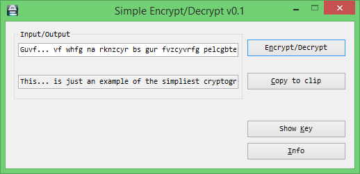
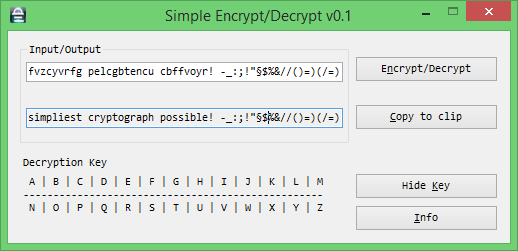

Simple Encrypt Decrypt
======================
Easy string encryption, features:

- ROT 5 (Numeric)
- ROT 13
- ROT 47
- ROT 18
- ROT by custom number (0-25)

### Enjoying this?
Just star the repo or make a donation.

Your help is valuable since this is a hobby project for all of us: we do development during out-of-office hours.

### Screenshot

 

### Contribution
Pull requests are very welcome.

### Copyrights
Simple Encrypt Decrypt was initially written by **Markus Karl Wackermann**.
